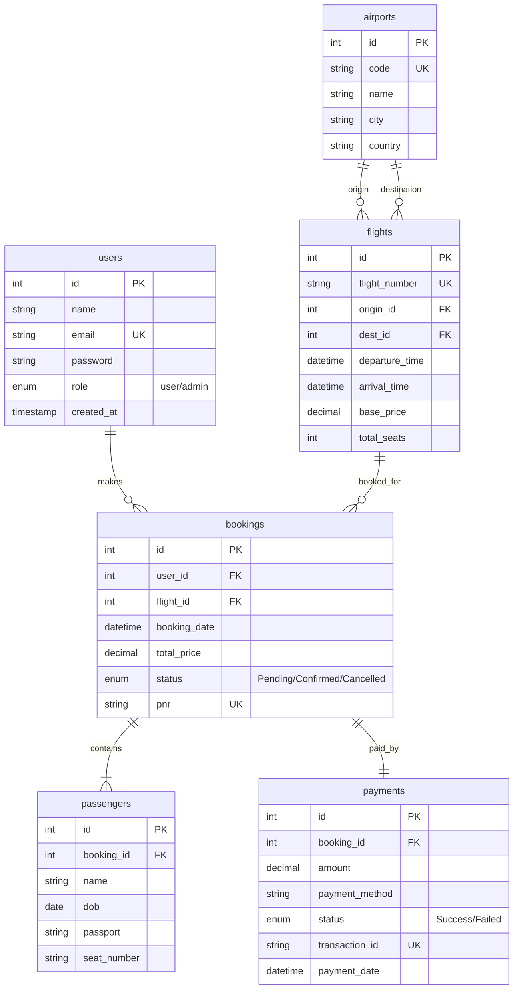

# ✈️ ARR Airlines (Luxury Class Travel Booking System)

[](https://www.php.net/)
[](https://www.mysql.com/)
[](https://getbootstrap.com/)
[](LICENSE)

Experience the pinnacle of air travel booking with **ARR Airlines**, a fully-featured, premium web application built for seamless flight search, seat reservation, and booking management. Designed with a stunning **glassmorphism user interface**, custom micro-animations, and a highly responsive design, ARR Airlines offers an immersive and premium user experience out of the box.

---

## ✨ Features Overview

ARR Airlines is designed as a modular, lightweight, and robust demonstration of a modern flight reservation flow. It is optimized for both educational purposes and local production environments.

### 🌟 1. Immersive Premium UI
*   **Modern Glassmorphism Design:** Subtle transparency, gorgeous blurs, and gradient borders that give the app a premium, high-tech aesthetic.
*   **Dynamic Responsive Layout:** Seamlessly adapts across mobile, tablet, and desktop views.
*   **Micro-Animations:** Fluid transitions, hover effects, and interactive tab switches.

### 🔍 2. Real-Time Flight Search & Filtering
*   **Interactive Search Console:** Search flights by origin, destination, date, and passenger count.
*   **Global Airport Database:** Pre-populated with over **100+ global international airports** spanning every major country.
*   **Dynamic Search Filtering:** Displays real-time matching flights, details, and dynamic base prices.

### 🎫 3. End-to-End Booking Wizard
*   **Step-by-Step Flow:** Clean multi-stage wizard logic leading the user smoothly through the process:
    *   **Step 1:** Passenger details collection (Name, Date of Birth, Passport).
    *   **Step 2:** Interactive seat map selection.
    *   **Step 3:** Review order and dynamic price calculations.
    *   **Step 4:** Payment simulation and checkout.
*   **E-Ticket Generation:** Automatically compiles passenger information, allocated seats, base price, and a unique PNR to generate a digital, printable E-Ticket.

### 📊 4. Interactive User Dashboard
*   **Session-Based Dashboards:** Secure login and sign-up with instant user dashboards.
*   **Manage Bookings:** View active bookings, cancel flights, track payment statuses, and re-download E-Tickets with a single click.

### 🛡️ 5. Admin Control Center
*   **Admin Panel:** Access analytics for all bookings across the platform.
*   **Global Visibility:** Oversee passenger passport records, transaction details, active PNRs, and cancel bookings system-wide.

---

## 🛠️ Tech Stack & Database Schema

The platform is engineered using modern web core standards and procedural PHP logic, making it easy to read, refactor, and run locally.

*   **Frontend:** Bootstrap 5.3, Custom Vanilla CSS, Bootstrap Icons, Google Fonts (Outfit / Inter)
*   **Backend:** PHP 7.4+ (Procedural and modular)
*   **Database:** MySQL / MariaDB (Optimized schema with foreign keys and cascade deletions)
*   **Configuration:** Simple Environment Variable loader using `.env` files

### Database Schema Visualization


---

## 🚀 Quick Setup & Installation

Follow these quick steps to get ARR Airlines up and running on your local machine using XAMPP (or any Apache/PHP/MySQL stack).

### Prerequisites
*   [XAMPP](https://www.apachefriends.org/) (with PHP 7.4+ and MySQL/MariaDB)
*   [Git](https://git-scm.com/)

### Step-by-Step Installation

1.  **Clone the Repository**
    Clone the project into your XAMPP `htdocs` directory:
    ```bash
    cd C:\xampp\htdocs
    git clone https://github.com/abdullahfaiz030/ARR-Airlines.git
    cd ARR-Airlines
    ```

2.  **Set Up Environment Variables**
    Duplicate the example environment file:
    ```bash
    cp .env.example .env
    ```
    Open `.env` and verify the settings for your local database. By default, XAMPP uses:
    ```ini
    DB_HOST=localhost
    DB_USER=root
    DB_PASS=
    DB_NAME=project
    ```

3.  **Run the Database Seeder**
    Ensure Apache and MySQL are running in your XAMPP Control Panel. Then open your browser and navigate to:
    ```
    http://localhost/ARR-Airlines/setup_db.php
    ```
    This script will:
    *   Create the database schema.
    *   **Seed over 100+ global international airports.**
    *   **Generate thousands of randomized flights** distributed over the next 14 days.
    *   Set up a default Administrator account.

4.  **Launch the Application**
    Visit the booking home page and begin your travel experience:
    ```
    http://localhost/ARR-Airlines
    ```

---

## 🔐 Administrative & User Access

The database seeder automatically configures a default admin account to allow immediate testing of the management dashboard.

| Role | Username / Email | Password | Dashboard Access |
| :--- | :--- | :--- | :--- |
| **System Administrator** | `admin@arrairlines.com` | `admin123` | Full control over bookings & operations |
| **User Registration** | *Sign up dynamically on the website* | *User-defined* | Personal flight management & tickets |

---

## 📂 Project Structure

```placeholder
ARR-Airlines/
│
├── .git/                      # Git repository history
├── imp/                       # Supplementary assets / resources
├── .env.example               # Environment variables template
├── .gitignore                 # Standard file exclusions
├── LICENSE                    # MIT License
├── README.md                  # Comprehensive project documentation
│
├── config.php                 # Core configurations & db connection
├── header.php                 # Shared responsive header layout & styles
├── footer.php                 # Shared footer layout & analytics scripts
├── index.php                  # Interactive Hero Section & Flight Search Form
├── login.php / signup.php     # Session-based secure user authentication
├── logout.php                 # User session termination
│
├── search_results.php         # Real-time search matching flights display
├── step1.php                  # Passenger details collection
├── steps2.php                 # Interactive Seat Map Selection
├── steps3.php                 # Pricing details and confirmation check
├── steps4.php                 # Payment simulation and transaction trigger
├── process_booking.php        # Core backend booking process
├── success.php                # Order summary & success status
├── ticket.php                 # Premium digital E-ticket generator
│
├── dashboard.php              # User dashboard for tracking & cancelling
├── admin.php                  # Global admin panel for complete systems audit
│
├── logo.png                   # Brand Identity Assets
└── airplane-background.jpg    # Premium Hero Section Asset
```

---

## 🔒 Security Practices & Notes

*   **Database Credentials:** Do not commit your `.env` file to public repositories. It is already added to `.gitignore` to prevent leaks.
*   **Local Use:** This is an interactive demo application. To adapt it for production use, it is highly recommended to implement password hashing for all user accounts, parameterized SQL statements, and strict CSRF tokens.

---

## 📄 License

This project is licensed under the MIT License - see the [LICENSE](LICENSE) file for details.

Developed with 💙 for the ultimate luxury air travel demo. Enjoy your flight!
